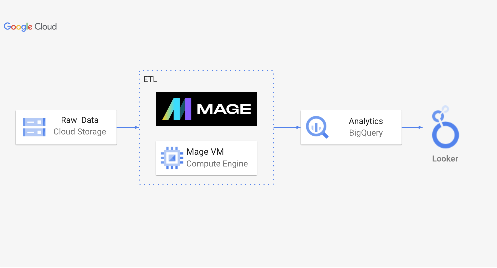
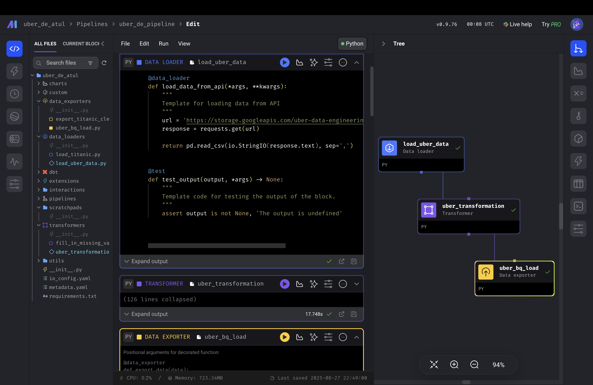

#  Uber Data Engineering Pipeline


## Key Highlights
- **End-to-End Pipeline** - Complete ETL workflow from raw CSV to analytics-ready BigQuery tables  
- **Star Schema Design** - Dimensional modeling with 1 fact table and 7 optimized dimension tables  
- **100K+ Trip Records** - Large-scale NYC Uber dataset processing and transformation  
- **Mage AI Orchestration** - Modern visual pipeline builder with Python-based transformations  
- **Cloud-Native Architecture** - Google Cloud Storage, BigQuery, and Looker Studio integration

## Overview
This project implements a data engineering pipeline that processes NYC Uber trip records using dimensional modeling and cloud-native tools. The pipeline transforms 100,000+ trip records into an analytics-ready star schema using Mage AI orchestration on Google Cloud Platform.

---

## Architecture



**Data Flow**: Raw CSV → Mage AI ETL → BigQuery Data Warehouse → Looker Analytics

**Technology Stack**:
- **Orchestration**: Mage AI with visual pipeline builder
- **Storage**: Google Cloud Storage for data lake
- **Processing**: Python with pandas for dimensional modeling
- **Warehouse**: BigQuery with star schema design
- **Analytics**: Looker Studio for business dashboards

---

## Data Model


The pipeline implements a star schema with one fact table and seven dimension tables:

**Fact Table**: `fact_table` - Central trip metrics with foreign keys

**Dimension Tables**:
- `datetime_dim` - Pickup/dropoff times with extracted features (hour, day, month, weekday)
- `passenger_count_dim` - Number of passengers per trip
- `trip_distance_dim` - Distance traveled for each trip  
- `rate_code_dim` - Rate types (Standard, JFK, Newark, Nassau/Westchester, Negotiated, Group)
- `pickup_location_dim` - Pickup coordinates (latitude, longitude)
- `dropoff_location_dim` - Dropoff coordinates (latitude, longitude)
- `payment_type_dim` - Payment methods (Credit Card, Cash, No Charge, Dispute, Unknown, Voided)

---

## Pipeline Implementation



### Data Processing Workflow

**1. Data Ingestion**
- Loads NYC TLC trip data from Google Cloud Storage
- Source: `https://storage.googleapis.com/uber-data-engineering-project/uber_data.csv`
- Processes 100,000+ trip records with 19 columns

**2. Dimensional Transformation**
```python
def create_dimensional_tables(df):
    """Transform raw trip data into star schema"""
    
    # Extract datetime features
    datetime_dim = df[['tpep_pickup_datetime', 'tpep_dropoff_datetime']].copy()
    datetime_dim['pickup_hour'] = pd.to_datetime(datetime_dim['tpep_pickup_datetime']).dt.hour
    datetime_dim['pickup_day'] = pd.to_datetime(datetime_dim['tpep_pickup_datetime']).dt.day
    datetime_dim['pickup_month'] = pd.to_datetime(datetime_dim['tpep_pickup_datetime']).dt.month
    datetime_dim['pickup_year'] = pd.to_datetime(datetime_dim['tpep_pickup_datetime']).dt.year
    datetime_dim['pickup_weekday'] = pd.to_datetime(datetime_dim['tpep_pickup_datetime']).dt.weekday
    
    # Create location dimensions
    pickup_dim = df[['pickup_longitude', 'pickup_latitude']].drop_duplicates().reset_index(drop=True)
    dropoff_dim = df[['dropoff_longitude', 'dropoff_latitude']].drop_duplicates().reset_index(drop=True)
    
    # Generate surrogate keys and build fact table
    fact_table = create_fact_table_with_foreign_keys(df, datetime_dim, pickup_dim, dropoff_dim)
    
    return fact_table, datetime_dim, pickup_dim, dropoff_dim
```

**3. BigQuery Loading**
- Exports transformed dimensional tables to BigQuery
- Creates optimized schema with proper data types
- Implements date-based partitioning for query performance

**4. Analytics Layer**
```sql
-- Revenue Analysis by Payment Type
SELECT 
    payment_type_name,
    COUNT(*) as total_trips,
    ROUND(AVG(total_amount), 2) as avg_fare,
    ROUND(SUM(total_amount), 2) as total_revenue
FROM `project.dataset.tbl_analytics`
GROUP BY payment_type_name
ORDER BY total_revenue DESC;

-- Peak Hours Analysis
SELECT 
    EXTRACT(HOUR FROM tpep_pickup_datetime) as hour,
    COUNT(*) as trip_count,
    ROUND(AVG(trip_distance), 2) as avg_distance
FROM `project.dataset.tbl_analytics`
GROUP BY hour
ORDER BY trip_count DESC;
```

---

## Business Insights

The analytics-ready data model enables:
- **Revenue Optimization** - Fare pattern analysis by location and time
- **Operational Planning** - Peak hour identification for resource allocation  
- **Geographic Intelligence** - Pickup/dropoff hotspot mapping
- **Customer Behavior** - Payment preference and trip characteristic analysis

---

## Getting Started

### Prerequisites
- Google Cloud Platform account with billing enabled
- Google Compute Engine instance (e2-medium or higher)
- Python 3.8+ environment

### Setup Instructions

1. **Environment Setup** (from `commands.txt`):
```bash
sudo apt-get update && sudo apt-get upgrade -y
sudo apt-get install python3-distutils python3-apt wget -y
wget https://bootstrap.pypa.io/get-pip.py
sudo python3 get-pip.py
sudo pip3 install mage-ai pandas google-cloud google-cloud-bigquery
```

2. **Initialize Mage Project**:
```bash
mage init uber_data_pipeline
cd uber_data_pipeline
mage start uber_data_pipeline
```

3. **Access Pipeline**: Navigate to `http://your-instance-ip:6789`

---

## Project Structure

```
uber-data-pipeline/
├── README.md                      # Project documentation
├── commands/                      # Setup commands
│   └── commands.txt              # Complete installation script
├── data/                         # Data storage
│   └── uber_data.csv            # NYC trip dataset
├── images/                       # Documentation visuals
│   ├── architecture_diagram.png  # Architecture overview
│   ├── data_model.jpeg          # Star schema diagram
│   └── mage_pipeline.png        # Pipeline workflow
├── mage/                         # Pipeline implementation
│   └── Uber Data Pipeline.ipynb # Transformation notebook
└── sql/                          # Analytics queries
    ├── analytics_query.sql       # Table creation scripts
    └── business_queries.sql      # Business intelligence queries
```

---

## Technical Achievements

- **Dimensional Modeling**: Implemented star schema with proper normalization and surrogate keys
- **Cloud Integration**: Seamless data flow between Google Cloud Storage and BigQuery
- **Pipeline Orchestration**: Visual pipeline development with Mage AI's modern interface
- **Analytics Optimization**: Query-optimized tables with partitioning and clustering

---

## Future Enhancements

- Real-time streaming with Apache Kafka integration
- Machine learning models for demand prediction using BigQuery ML
- Advanced geospatial analysis with PostGIS
- Automated data quality monitoring and alerting

---

## Contributing

Contributions welcome! Focus areas include:
- Additional data source integrations
- Enhanced data quality checks
- Performance optimizations
- Advanced analytics features

---
## Conclusion
- This project demonstrates end-to-end data engineering capabilities through the implementation of a dimensional data warehouse for transportation analytics. The pipeline successfully transforms raw NYC trip data into a star schema optimized for business intelligence, showcasing proficiency in modern orchestration tools, cloud architecture, and analytical data modeling. The modular design using Mage AI enables easy maintenance and extensibility for additional data sources or advanced analytics requirements.

- The implementation reflects practical data engineering skills including API integration, dimensional modeling, cloud service orchestration, and performance optimization. The resulting analytics-ready dataset supports complex business queries for revenue analysis, operational planning, and customer insights, providing a solid foundation for data-driven decision making in transportation and logistics domains.
  
---

*Built with Mage AI and Google Cloud Platform*


